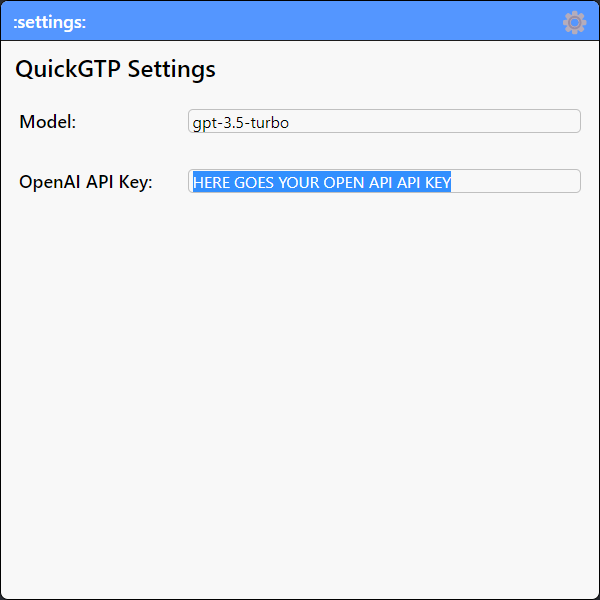

  

<h1 align="center">QuickGPT</h1>

A faster way to ask GPT

  <a href="https://github.com/dubisdev/quickgpt/releases/latest">
    🔗 Go to Download Page
  </a>
    &nbsp; | &nbsp; Give it a Star ⭐ | &nbsp;
    <a href="https://www.buymeacoffee.com/dubisdev">Support the project 🤝</a>
    &nbsp; | &nbsp;
    <a href="https://twitter.com/intent/tweet?text=I%27m%20using%20%23quickgpt%20-%20a%20faster%20way%20to%20ask%20GPT%20by%20%40dubisdev%0A%0Ahttps%3A%2F%2Fgithub.com%2Fdubisdev%2Fquickgpt">
      Share it on Twitter 🐦
    </a>

## 🚀 Features

- 🔠 Write your question and GPT will answer it
- Use the `Alt + A` shortcut to toggle the app
- ~~⚙️ Choose the model you want to use~~ (Available soon)

  

## ⚙️ Configuration

The app works with the OpenAI API, so you need to get an API key to use it.

1. Get the API key [here](https://platform.openai.com/account/api-keys).
2. Type `:settings:` in the QuickGPT search bar
3. Paste it in the `OpenAI API Key` field
4. Start using it!

## 🔜 Roadmap

## ⚖️ License

© [David Jimenez](https://dubis.dev)
